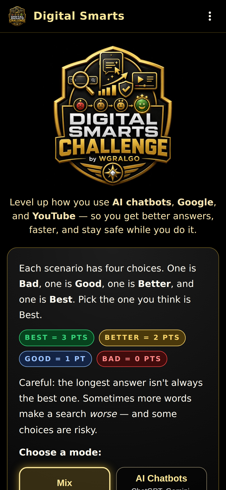
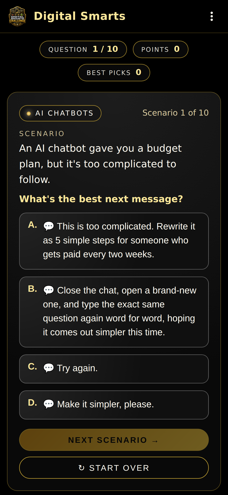
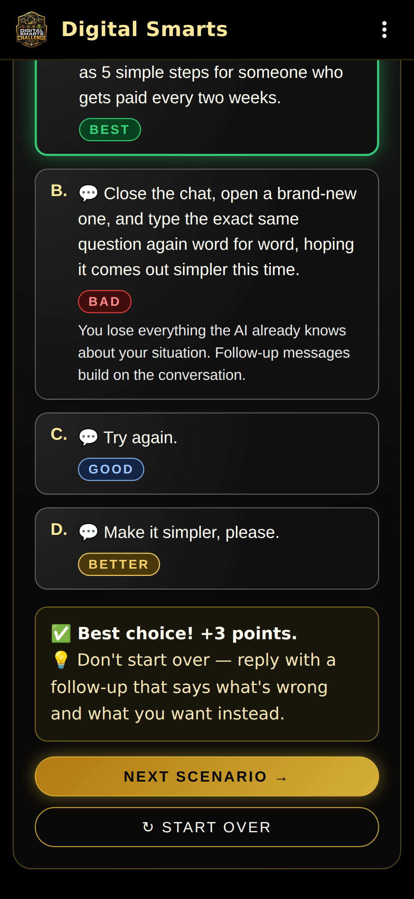
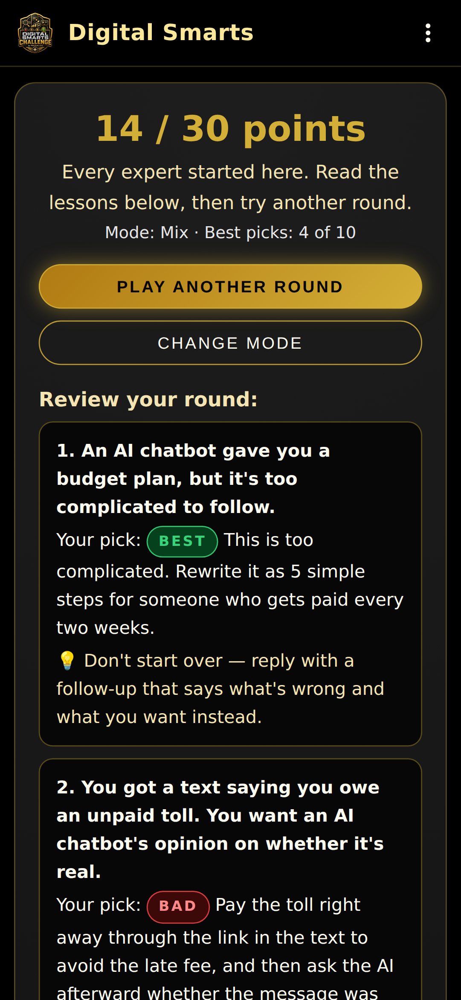
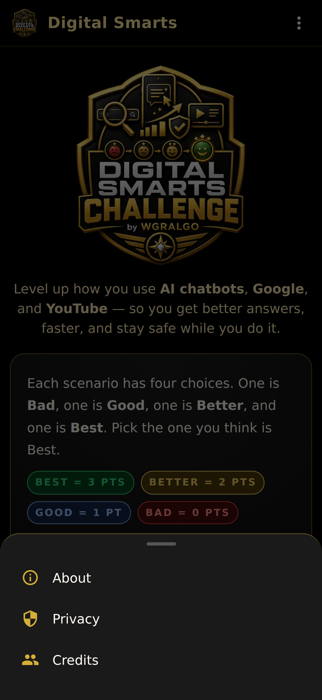
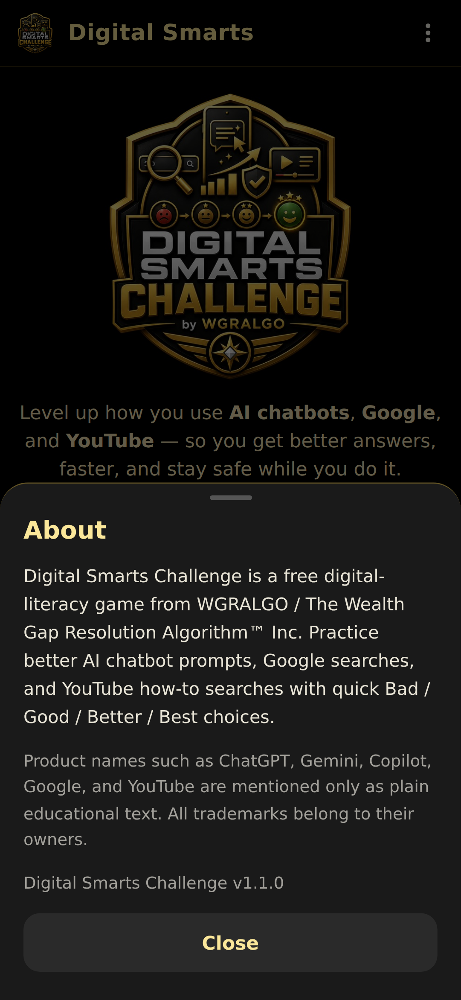

# WGRALGO Digital Smarts Challenge

Digital Smarts Challenge is a free educational Android app from **The Wealth Gap Resolution Algorithm™ Inc.** It helps users practice stronger AI chatbot prompts, Google searches, and YouTube how-to searches through quick **Bad / Good / Better / Best** scenarios.

- **Version:** 1.1.0
- **Package:** `org.wgralgo.digitalsmartschallenge`
- **Platform:** Android (offline, sideload via APK)
- **Website:** https://thewealthgapresolutionalgorithm.org/digital-smarts-challenge/
- **License:** GPL-3.0-or-later

---

## Features

- **60 built-in scenarios** across three modes: **AI Chatbots**, **Google**, and **YouTube**, or play a **Mix** of all three.
- 10 shuffled scenarios per round.
- Every answer scores: **Best = 3**, **Better = 2**, **Good = 1**, **Bad = 0**.
- Instant feedback with a lesson after every answer, plus a full review at the end of the round.
- Real app look: black launch screen with the big WGRALGO logo, solid app bar, About / Privacy / Credits sheets, and Android back-button support (back closes a sheet, then returns to the menu, then asks before exiting).
- **100% offline.** No accounts, no ads, no analytics, no trackers, no internet permission.

## Screenshots

| Splash | Home | Question | Feedback |
|---|---|---|---|
|  |  |  |  |

| Results | Menu | About |
|---|---|---|
|  |  |  |

## How to install (sideload)

1. Download `DigitalSmartsChallenge-v1.1.0.apk` from the [Releases](../../releases) page.
2. On your Android device, allow installs from unknown sources for your file manager / browser.
3. Tap the APK to install.
4. Open **Digital Smarts Challenge** from your app drawer.

> **Upgrading from v1.0.0?** Version 1.1.0 is signed with a new key. Uninstall v1.0.0 first, then install v1.1.0. The app stores nothing on your device, so nothing is lost.

### Verify the APK

```
sha256sum DigitalSmartsChallenge-v1.1.0.apk
```

Compare against `DigitalSmartsChallenge-v1.1.0.apk.sha256` in the release.

Signing certificate (v1.1.0 and later):

- `CN=WGRALGO, OU=Digital Smarts Challenge, O=The Wealth Gap Resolution Algorithm Inc, C=US`
- SHA-256: `5F:01:6A:52:99:9E:0E:04:72:2F:2C:5E:D7:7F:F1:D5:4D:87:4E:2B:38:27:87:C8:C4:13:7C:BA:E4:E9:5B:9C`

```
apksigner verify --print-certs DigitalSmartsChallenge-v1.1.0.apk
```

## How to build from source

Requirements:
- Node.js 18+
- Android SDK + build-tools 34+
- Java 17

```
git clone https://github.com/WGRALGO/WGRALGO-Digital-Smarts-Challenge.git
cd WGRALGO-Digital-Smarts-Challenge
npm install
npx cap sync android
cd android
./gradlew :app:assembleDebug      # debug build
./gradlew :app:assembleRelease    # release (requires keystore.properties)
```

Release signing is configured via `android/keystore.properties` (not committed) or the env vars `DSC_KEYSTORE_FILE`, `DSC_KEYSTORE_PASSWORD`, `DSC_KEY_ALIAS`, `DSC_KEY_PASSWORD`.

Check a build before publishing:

```
bash tools/validate-release.sh android/app/build/outputs/apk/release/app-release.apk
```

## Releases (GitHub Actions)

- `.github/workflows/android.yml` builds a debug APK on every push and pull request.
- `.github/workflows/release.yml` builds, validates, signs, and publishes `DigitalSmartsChallenge-v<version>.apk` with its `.sha256` to GitHub Releases. Run it from the **Actions** tab or push a `v*` tag.

It needs these repository secrets: `DSC_KEYSTORE_BASE64`, `DSC_KEYSTORE_PASSWORD`, `DSC_KEY_ALIAS`, `DSC_KEY_PASSWORD`.

## Privacy summary

- No account required.
- No ads, analytics, trackers, or crash reporting.
- No data is sent to WGRALGO or any third party.
- No personal data is collected.
- The app declares **no network permission** — it runs fully offline.

See [PRIVACY.md](./PRIVACY.md) for the full statement.

## Educational disclaimer

Digital Smarts Challenge is for **educational awareness only**. It does not provide legal, financial, medical, cybersecurity, technical, or professional advice. The examples are simplified learning scenarios. Users should verify important information through trusted sources and qualified professionals when needed.

## License

This project is released under the **GNU General Public License v3.0**. See [LICENSE](./LICENSE).

## Contributors

See [CONTRIBUTORS.md](./CONTRIBUTORS.md).
